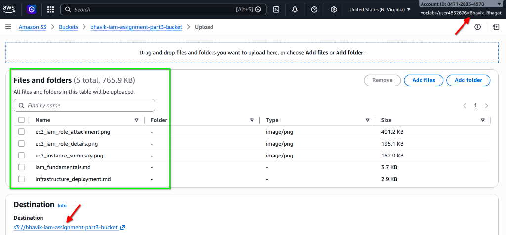
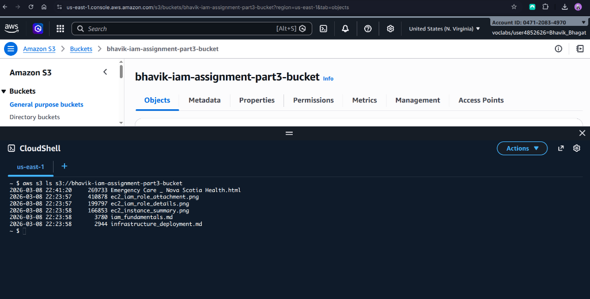

## Part 1: IAM Fundamentals

### IAM Definitions
The following key components are foundational to managing access in the AWS Management Console:

*   **IAM User**: An entity created within an AWS account to represent a specific person or application. AWS Users possess long-term credentials (like passwords or access keys) and are typically assigned permanent permissions to perform specific tasks.
*   **IAM Group**: A logical collection of IAM Users. Groups facilitate easier permission management by allowing administrators to attach policies to the group itself; every user added to that group automatically inherits those permissions.
*   **IAM Role**: An identity that can be assumed by trusted entities, such as IAM Users, AWS services (like EC2), or even federated users from external providers. Roles do not have long-term credentials; instead, they provide temporary security credentials when assumed.
*   **IAM Policy**: A JSON document that defines permissions. Policies can be "Allow" or "Deny" and specify exactly what actions can be performed on which AWS resources under what conditions. These are attached to users, groups, or roles to enforce security boundaries.

### S3 Managed Policy Comparison
In the AWS Management Console, managed policies provide a pre-defined set of permissions. Below is a comparison between the standard read-only and full access S3 policies:

| Feature | AmazonS3ReadOnlyAccess | AmazonS3FullAccess |
| :--- | :--- | :--- |
| **Primary Action** | Grants "Read" and "List" permissions to S3 resources. | Grants "Full Control" over all S3 resources. |
| **Permissions Allowed** | Includes `s3:Get*` and `s3:List*` actions. | Includes `s3:*` (global wildcard for all S3 actions). |
| **Data Modification** | **No**: Users cannot upload, delete, or modify objects or buckets. | **Yes**: Users can create, update, and delete buckets and objects. |

**Key Differences:**
The `AmazonS3FullAccess` policy allows critical administrative actions that `AmazonS3ReadOnlyAccess` explicitly forbids, such as:
*   `s3:CreateBucket` and `s3:DeleteBucket`
*   `s3:PutObject` (Uploading new data)
*   `s3:DeleteObject` (Permanently removing data)
*   `s3:PutBucketPolicy` (Modifying security settings of a bucket)

### Written Evidence: Role Selection and Principle of Least Privilege

#### Role Explanation for EMR_EC2_DefaultRole
The **EMR_EC2_DefaultRole** is a pre-configured service role designed specifically for Amazon EMR cluster instances. By attaching this role to an EC2 instance, the instance is granted the exact set of permissions it needs to interact securely with other AWS services, such as Amazon S3, Amazon CloudWatch, and Amazon EC2 itself. Crucially, this setup uses temporary security credentials, eliminating the need to store or manage permanent, long-term administrative access keys on the instance.

#### Justification for Least Privilege
Attaching the specific `EMR_EC2_DefaultRole` to an EC2 instance, rather than a broad `AdministratorAccess` role, is a direct application of the **Principle of Least Privilege (PoLP)**. In a production environment, an `AdministratorAccess` role would provide an instance with unrestricted permissions to delete buckets, modify VPC configurations, or even terminate other instances across the entire account. By using a specialized role, we ensure the instance can only perform the specific tasks required for the lab. This significantly reduces the "blast radius" of any potential security compromise.

## Part 2: Deploy Infrastructure

### Infrastructure Configuration Choices
For the deployment of the lab infrastructure in **us-east-1**, the EC2 instance (**i-042a537cb6b1f5b68**) was launched using **Amazon Linux 2023** and the **t3.micro** instance type. These choices were made based on:

*   **Cost-Effectiveness**: The `t3.micro` instance provides a balance of compute and performance that is ideal for administrative or low-traffic tasks while remaining budget-friendly.
*   **Modern and Secure Environment**: Amazon Linux 2023 provides a hardened, modern operating system environment with proactive security updates and optimized integration with AWS services.

### Security Comparison: IAM Roles vs. Hardcoded Access Keys
A critical technical requirement is the use of an **IAM Role** instead of hardcoding **IAM Access Keys** (Access Key ID and Secret Access Key). 

#### Elimination of Credential Leakage
Hardcoding long-term access keys creates a significant risk; if code is committed to version control or the filesystem is compromised, these static keys remain valid until manually revoked.

#### Temporary and Rotating Credentials (IMDS)
When an IAM Role is attached to an EC2 instance, AWS utilizes the **Instance Metadata Service (IMDS)** to provide temporary credentials. These credentials automatically rotate, are short-lived, and are scope-limited to the permissions of the role, drastically reducing the window of opportunity for an attacker.

### Implementation Evidence: Running Instance & Attached Role

## Part 3: S3 Secure Access Proof of Execution

### S3 Configuration Analysis
A private S3 bucket named **bhavik-iam-assignment-part3-bucket** was provisioned in **us-east-1**. The **"Block all public access"** setting was enforced, aligning with security best practices for protecting data at rest.

### The Role of Temporary Credentials
The EC2 instance successfully accessed the S3 bucket without any hardcoded keys. By using the **EMR_EC2_DefaultRole**, the instance queried the **Instance Metadata Service (IMDS)** to retrieve temporary security credentials. The AWS CLI utilized these credentials automatically to sign requests, allowing the instance to interact with S3 securely.

### Security Benefit: Contrast with Hardcoded Credentials
Unlike static access keys, which provide persistent access and are vulnerable to theft, the temporary credentials provided to the instance expire quickly and rotate automatically. This ensures that even in the case of a temporary compromise, the long-term risk to the account is minimized.

### Evidence of Execution

#### S3 Bucket Objects Overview
The following console view displays the complete list of files successfully uploaded to the private bucket, including the core documentation and system screenshots.

#### Web Content Deployment: HTML Evidence
As part of the web-focused component of the lab, a specific HTML file titled `Emergency Care _ Nova Scotia Health.html` was uploaded. This demonstrates the ability to store web assets securely, protected by the bucket's "Block all public access" settings.

#### EC2 Terminal Successful Execution
The screenshot below confirms that the EC2 terminal successfully executed the `aws s3 ls` command, listing the objects—including the newly uploaded HTML file—using the instance's assumed IAM Role.

## Architecture Diagram

The following diagram illustrates the network and identity-based security architecture implemented in this lab. The EC2 instance is placed in a **Public Subnet** (**subnet-0259e86a036c0d874**) within the **VPC** (**vpc-017f54d3680a074eb**), accessing the private S3 bucket via its attached **IAM Role**.

## Part 4: Security Reflection

### The Risks of Full Administrative Access
Using full administrative privileges for daily operational tasks is a significant security risk that directly violates the **Principle of Least Privilege (PoLP)**. When a junior cloud engineer or an automated process operates with `AdministratorAccess`, any accidental command execution or intentional security breach has unrestricted authority over the entire AWS account. This lack of granular control means that a simple configuration error could lead to the deletion of critical production databases or the exposure of sensitive S3 buckets. By restricting access to only the specific actions required for a task, organizations ensure that the default state is "deny," which is the cornerstone of a secure cloud architecture.

### The Danger of Hardcoded Access Keys
Hardcoding AWS Access Keys into application code or configuration files represents one of the most common and dangerous vulnerabilities in cloud development. Unlike **IAM Roles**, which provide temporary and rotating credentials, hardcoded keys are static and long-lived. If these keys are accidentally committed to a public version control repository or stored on an insecure server, an attacker can steal them and maintain persistent, unauthorized access until the keys are manually revoked. Furthermore, static keys are significantly easier to harvest through automated scanning tools, whereas the temporary credentials provided by the Instance Metadata Service (IMDS) for IAM Roles never leave the AWS environment, making them virtually impossible for an external attacker to intercept.

### Reducing the Blast Radius
In a real-world breach scenario, the "blast radius" refers to the extent of damage an attacker can cause once they have successfully compromised a single component. By using specific IAM Roles, such as the `EMR_EC2_DefaultRole` utilized in this lab, the blast radius is strictly confined to the permissions defined within that role's policy. If an attacker were to compromise the EC2 instance, they would only be able to interact with the specific S3 buckets and services granted to that role. This containment prevents horizontal movement across the infrastructure, ensuring that a single compromised instance does not lead to a total account takeover or widespread data exfiltration.

### The AWS Shared Responsibility Model
The **AWS Shared Responsibility Model** defines the security obligations of both the cloud provider and the customer. In the context of this lab:
*   **AWS's Responsibility**: AWS is responsible for "Security **of** the Cloud," which includes the physical infrastructure, the virtualization layer, and the foundational services like S3 and EC2. AWS ensures that the IAM service itself is highly available and that the physical hardware is protected.
*   **The User's Responsibility**: As the customer, I am responsible for "Security **in** the Cloud." This includes the proper configuration of IAM Policies, the selection of appropriate IAM Roles, and the enforcement of "Block Public Access" on S3 buckets. While AWS provides the tools for secure access, the responsibility for correctly implementing the principle of least privilege and ensuring data is not publicly exposed falls entirely on the user.
