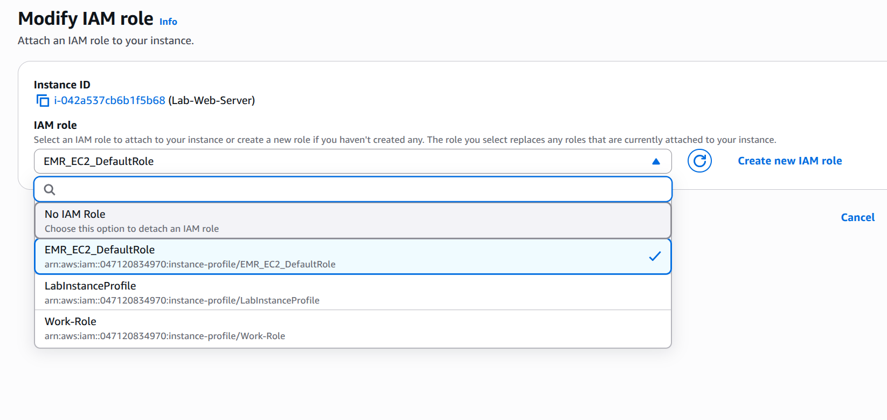
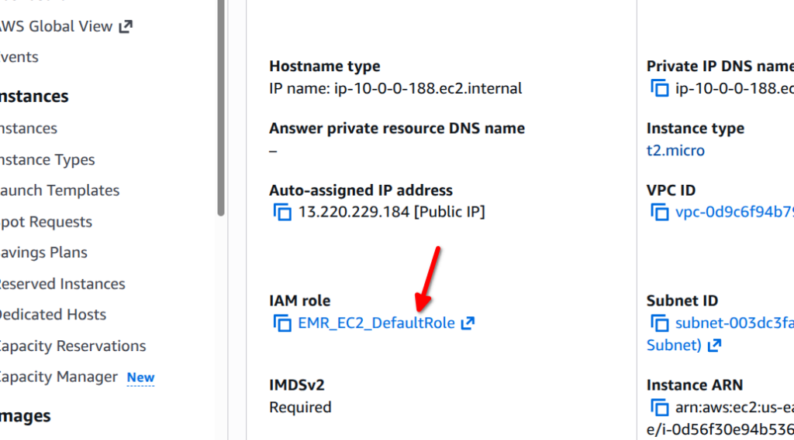

# IAM Lab Assignment: Part 1

## Part 1: IAM Fundamentals

### IAM Definitions
The following key components are foundational to managing access in the AWS Management Console:

*   **IAM User**: An entity created within an AWS account to represent a specific person or application. AWS Users possess long-term credentials (like passwords or access keys) and are typically assigned permanent permissions to perform specific tasks.
*   **IAM Group**: A logical collection of IAM Users. Groups facilitate easier permission management by allowing administrators to attach policies to the group itself; every user added to that group automatically inherits those permissions.
*   **IAM Role**: An identity that can be assumed by trusted entities, such as IAM Users, AWS services (like EC2), or even federated users from external providers. Roles do not have long-term credentials; instead, they provide temporary security credentials when assumed.
*   **IAM Policy**: A JSON document that defines permissions. Policies can be "Allow" or "Deny" and specify exactly what actions can be performed on which AWS resources under what conditions. These are attached to users, groups, or roles to enforce security boundaries.

### S3 Managed Policy Comparison
In the AWS Management Console, managed policies provide a pre-defined set of permissions. Below is a comparison between the standard read-only and full access S3 policies:

| Feature | AmazonS3ReadOnlyAccess | AmazonS3FullAccess |
| :--- | :--- | :--- |
| **Primary Action** | Grants "Read" and "List" permissions to S3 resources. | Grants "Full Control" over all S3 resources. |
| **Permissions Allowed** | Includes `s3:Get*` and `s3:List*` actions. | Includes `s3:*` (global wildcard for all S3 actions). |
| **Data Modification** | **No**: Users cannot upload, delete, or modify objects or buckets. | **Yes**: Users can create, update, and delete buckets and objects. |

**Key Differences:**
The `AmazonS3FullAccess` policy allows critical administrative actions that `AmazonS3ReadOnlyAccess` explicitly forbids, such as:
*   `s3:CreateBucket` and `s3:DeleteBucket`
*   `s3:PutObject` (Uploading new data)
*   `s3:DeleteObject` (Permanently removing data)
*   `s3:PutBucketPolicy` (Modifying security settings of a bucket)

### Written Evidence: Role Selection and Principle of Least Privilege

#### Role Explanation for EMR_EC2_DefaultRole
The **EMR_EC2_DefaultRole** is a pre-configured service role designed specifically for Amazon EMR cluster instances. By attaching this role to an EC2 instance, the instance is granted the exact set of permissions it needs to interact securely with other AWS services, such as Amazon S3, Amazon CloudWatch, and Amazon EC2 itself. Crucially, this setup uses temporary security credentials, eliminating the need to store or manage permanent, long-term administrative access keys on the instance.

#### Justification for Least Privilege
Attaching the specific `EMR_EC2_DefaultRole` to an EC2 instance, rather than a broad `AdministratorAccess` role, is a direct application of the **Principle of Least Privilege (PoLP)**. In a production environment, an `AdministratorAccess` role would provide an instance with unrestricted permissions to delete buckets, modify VPC configurations, or even terminate other instances across the entire account. By using a specialized role, we ensure the instance can only perform the specific tasks required for the lab. This significantly reduces the "blast radius" of any potential security compromise, as any attacker gaining access to the instance would be restricted by the role's limited policy rather than having full administrative control.

