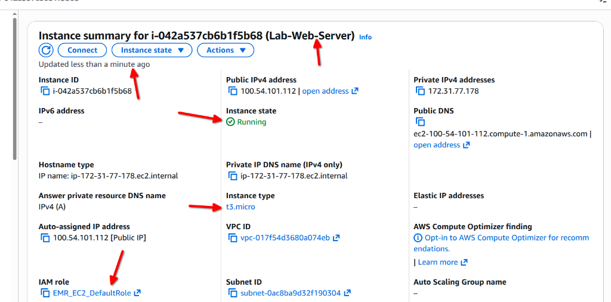

# IAM Lab Assignment: Part 2

## Part 2: Deploy Infrastructure

### Infrastructure Configuration Choices
For the initial deployment of the lab infrastructure, an EC2 instance was launched using **Amazon Linux 2023** and the **t3.micro** instance type. These specific configuration choices were made based on several key technical and economic factors:

*   **Cost-Effectiveness**: The `t3.micro` instance is part of the AWS Free Tier (where applicable) and provides a balance of compute, memory, and network resources that is well-suited for low-traffic applications or administrative tasks. It utilizes "burstable" performance, making it an efficient choice for the junior cloud engineer's development and testing environment.
*   **Modern and Secure Environment**: Amazon Linux 2023 (AL2023) is a modern, high-performance operating system designed specifically for AWS. It provides a more frequent release cycle and proactive security updates compared to its predecessors. By selecting AL2023, the infrastructure benefits from a hardened kernel, updated cryptographic libraries, and optimized integration with AWS services, providing a stable foundation for secure cloud operations.

### Security Comparison: IAM Roles vs. Hardcoded Access Keys
A critical security requirement for this lab is the use of an **IAM Role** instead of hardcoding **IAM Access Keys** (Access Key ID and Secret Access Key) directly into the application code or configuration. The technical advantages of using roles include:

#### Elimination of Credential Leakage
Hardcoding long-term credentials (access keys) creates a significant security risk. If the application code is accidentally committed to a version control system (like GitHub) or if the instance's filesystem is compromised, these static keys can be stolen and used indefinitely by an unauthorized actor. In contrast, an IAM Role does not have long-term credentials.

#### Temporary and Rotating Credentials (IMDS)
When an IAM Role is attached to an EC2 instance, AWS utilizes the **Instance Metadata Service (IMDS)** to provide temporary security credentials directly to the instance. These credentials:
1.  **Automatically Rotate**: AWS rotates the credentials multiple times per day without any manual intervention.
2.  **Are Short-Lived**: If the credentials were ever intercepted, they would expire shortly thereafter, drastically reducing the potential "window of opportunity" for an attacker.
3.  **Scope-Limited**: The credentials only possess the permissions explicitly granted to the IAM Role, adhering to the principle of least privilege.

---

### Implementation Evidence

#### Running EC2 Instance & Attached IAM Role
The screenshot below shows the instance summary for the "Lab-Web-Server", confirming it is in the **Running** state, utilizing the **t3.micro** instance type, and has the **EMR_EC2_DefaultRole** successfully attached.

