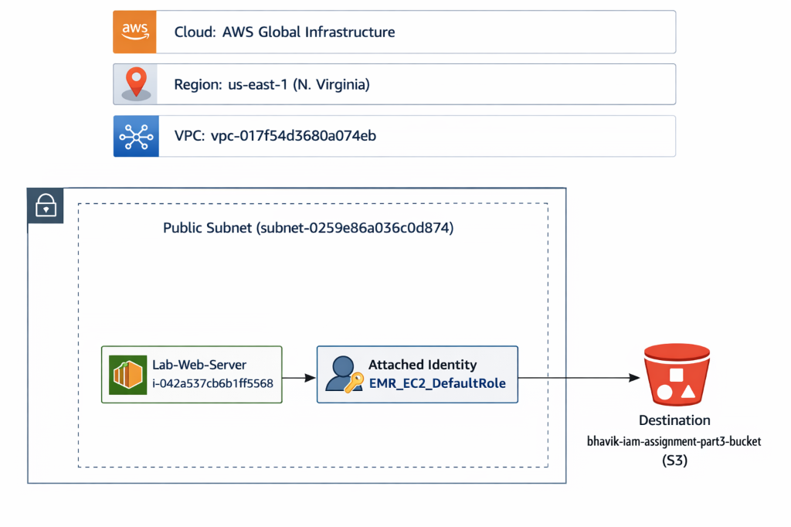

# IAM Lab Assignment: Network Infrastructure

## Network Topology and Connectivity

### Network Architecture Overview
The infrastructure for this lab is deployed within a dedicated Amazon Virtual Private Cloud (VPC), specifically identified as **vpc-017f54d3680a074eb**. Within this VPC, the "Lab-Web-Server" EC2 instance has been launched into a **Public Subnet** (**subnet-0259e86a036c0d874**). This architectural placement ensures the instance is capable of both reaching the public internet (for service updates and API communication) and being reachable for administrative management.

### Connectivity Choice: EC2 Instance Connect
Administrative management of the instance is handled via **EC2 Instance Connect**. This connectivity choice provides a secure, browser-based SSH interface directly through the AWS Management Console. By utilizing Instance Connect, the environment achieves several security and operational benefits:
*   **Keyless Access**: It eliminates the need to generate, distribute, and manage local SSH private keys (PEM files), which are frequently lost or compromised in traditional workflows.
*   **Identity-Based Management**: Access is governed by IAM policies, ensuring that only authenticated AWS users with the appropriate permissions can initiate a management session.
*   **Public IP Utilization**: The instance utilizes a Public IPv4 address to facilitate this communication, providing a direct and efficient path for management without the complexity of a VPN or bastion host for this specific lab scenario.

### Security Justification: Network vs. Identity
While the instance resides in a public subnet, its security posture is multi-layered. Crucially, its ability to interact with sensitive internal resources, such as the private S3 bucket, is not determined by its network location but by the **IAM Role (EMR_EC2_DefaultRole)** attached to it.

Even with public network visibility, the instance is restricted to a granular set of permissions permitted by its role. This separation of concerns ensures that the application layer follows the **Principle of Least Privilege**; the instance can only perform the specific S3 actions necessary for the lab, regardless of its network-facing configuration. This defense-in-depth approach ensures that network accessibility does not equate to unrestricted data access.
