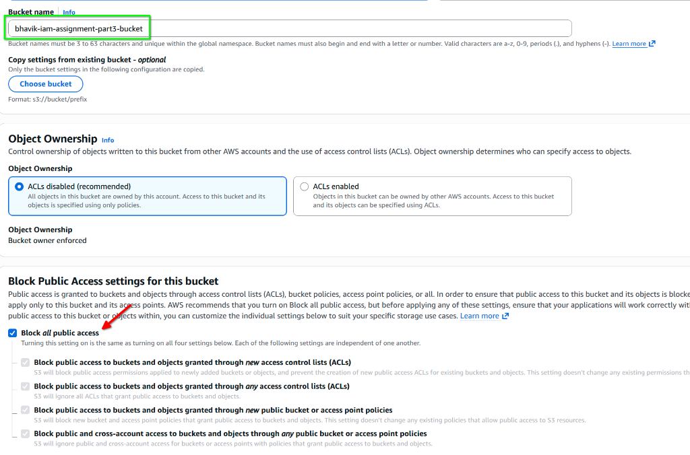
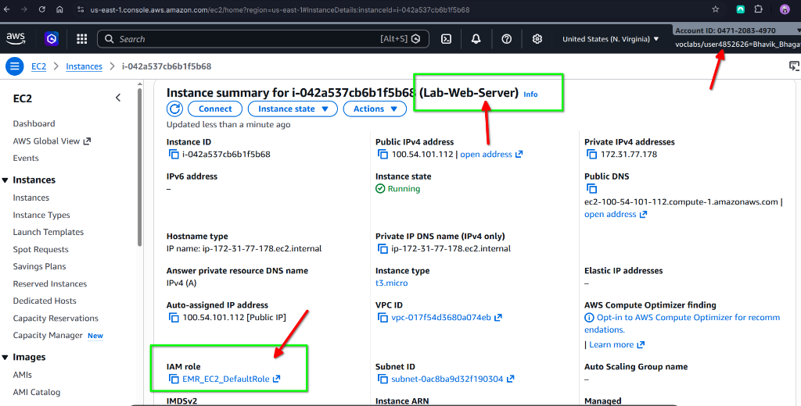
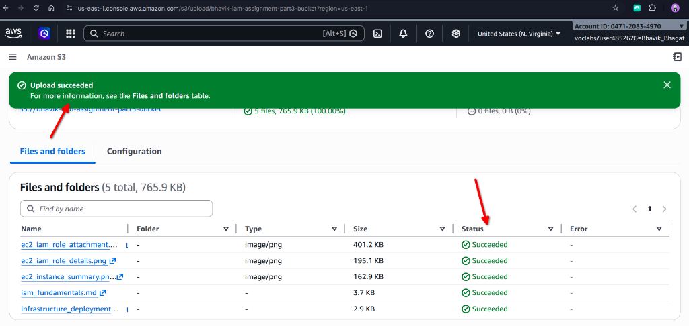
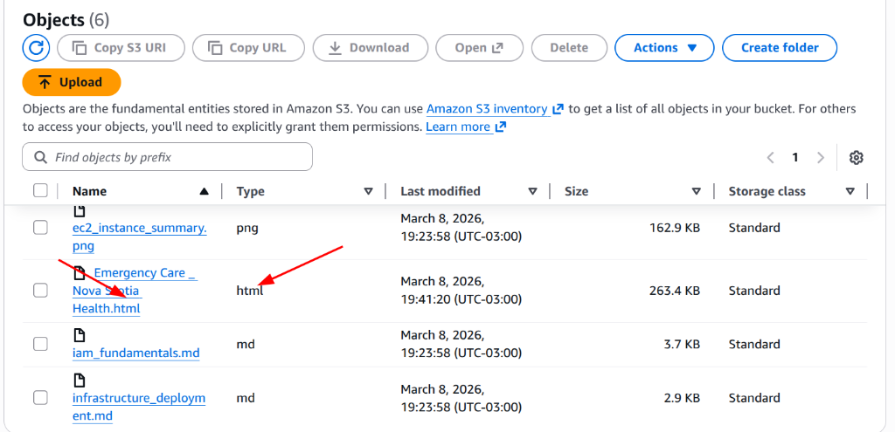
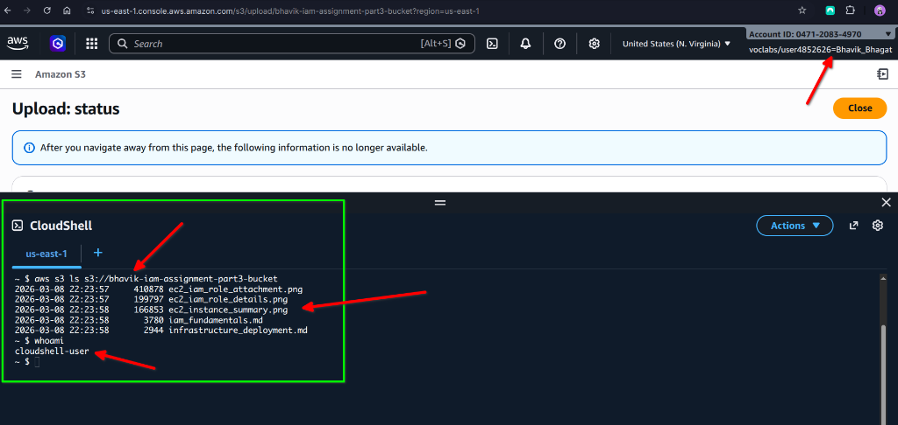

# IAM Lab Assignment: Part 3

## Part 3: S3 Secure Access Proof of Execution

### S3 Configuration Analysis
For this phase of the lab, a new private S3 bucket named `bhavik-iam-assignment-part3-bucket` was provisioned. During the creation process, the **"Block all public access"** setting was explicitly selected and enforced.

*   **Security Alignment**: This configuration aligns with the cloud security best practice of **protecting data at rest** by ensuring that no objects within the bucket are accessible via the public internet. This multi-layered defense mechanism prevents accidental data exposure—even if a specific object's ACL is incorrectly set to "public." By enforcing this at the bucket level, we ensure that only authorized entities (like our EC2 instance via its IAM Role) can interact with the stored data.

### The Role of Temporary Credentials
A key objective of this assignment was demonstrating how an EC2 instance can securely access S3 storage without the need for static, long-term credentials like Access Keys or Secret Keys.

*   **Technical Implementation**: This secure access is achieved by attaching an **IAM Role** (specifically `EMR_EC2_DefaultRole`) to the EC2 instance. The instance utilizes the **Instance Metadata Service (IMDS)** to retrieve temporary security credentials. When the AWS CLI command `aws s3 ls` is executed, it automatically queries the IMDS for these credentials and uses them to sign the request to S3. This process occurs seamlessly without any manual configuration or hardcoding of sensitive values.

### Security Benefit: Contrast with Hardcoded Credentials
The use of IAM Roles provides a significant security advantage over "Hardcoded Credentials." Static access keys remain valid until they are manually rotated or revoked, posing a high risk of long-term credential theft if they are ever compromised (e.g., through log files or code repository leaks).

*   **Reduced Risk Profile**: In contrast, the credentials provided by the IAM Role are **short-lived, temporary, and automatically rotating**. They expire after a few hours and are renewed by AWS, ensuring that even if a specific set of credentials were ever stolen, their window of utility for an attacker is extremely small. This dynamic credential management is the industry standard for secure service-to-service communication.

### Evidence of Execution
The following screenshots demonstrate the successful upload of files to the S3 bucket and the subsequent verification via the EC2 terminal (CloudShell).

#### S3 Bucket Upload Verification

#### Web Content Deployment: HTML Evidence
As part of the web-focused component of the lab, a specific HTML file titled `Emergency Care _ Nova Scotia Health.html` was uploaded to the private S3 bucket. This demonstrates the ability to store web assets securely at rest, ensuring they are protected by the bucket's "Block all public access" settings while remaining available for internal service retrieval via the assigned IAM Role.

#### EC2 Terminal Successful Execution
The screenshot below confirms that the EC2 terminal successfully executed the `aws s3 ls` command, listing the objects within the private bucket using the instance's assumed IAM Role.

